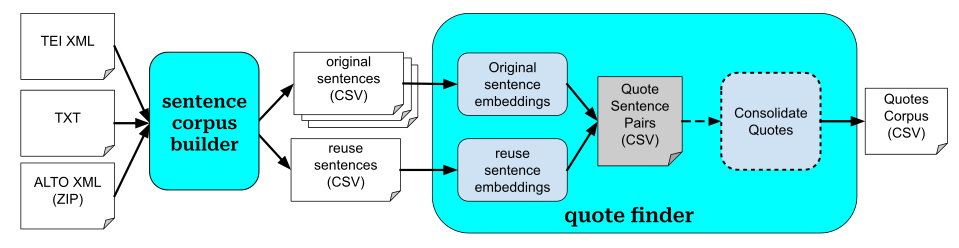

# Technical Design

______________________________________________________________________

### Statement of Purpose

The `remarx` software package was developed to provide a simple user interface to enable researchers to find quotations in German-language content, and supports generating a dataset of similar passages (i.e., quotations or partial quotations) between the two sets of texts.

The immediate use case motivating the development of this software was to identify direct quotes of Karl Marx's _Manifest der Kommunistischen Partei_ (Communist Manifesto) and the first volume of _Das Kapital_ (Kapital) within a subset of _Die Neue Zeit_ (DNZ) articles.

Core functionality: takes text content as input from _original_ (i.e., source of quotes) and _reuse_ (i.e., where quotations occur) texts, and builds a sentence or passage level quotation corpus.

### Application Architecture

The application has two main components: Sentence Corpus Builder and Quote Finder.

The Sentence Corpus Builder is used to convert input content into the format needed for the Quote Finder.
It takes a single file in a supported format (TEI XML, ALTO XML, plain text) and outputs a CSV file containing a sentence-level text corpus generated from the input text.

The Quote Finder requires two sets of inputs: reuse and original sentence corpora. Each input is a CSV file as generated by the Sentence Corpus Builder, where each row corresponds to a sentence from a reuse or original text. Currently, the system allows selecting multiple original corpora and one reuse corpus. The quote finder generates a CSV file with identified quotations found when comparing the reuse and original corpora.

The Quote Finder has two key components:

- **Sentence-Level Quote Detection.** This component takes an original and reuse sentence corpus as input and outputs a corpus of sentence-pairs corresponding to quotes.

- **Quote Consolidation.** In this optional step, detected sentence pairs that are sequential in both original and reuse corpora are consolidated into multi-sentence passages.

### Component Details

_Description of each component and its functionality_

#### Sentence Corpus Builder

This component is a python program that extracts sentences from some number of input texts and compiles them into a single sentence-level corpus CSV file.
It can be broken into two core stages: text extraction and sentence segmentation.

Text extraction will be customized to each of the supported input types:

- MEGA digital TEI-XML files
- Communist Manifesto TXT files as produced by a custom, one-time script converting HTML files to plaintext
- Transcription ALTO-XML files as produced by the research team’s custom text transcription and segmentation pipeline
- Plaintext files (TXT)

Each of these solutions will involve extracting the text from the corresponding file type that can be subsequently passed to sentence segmentation.

Sentence segmentation will rely on an off-the-shelf NLP package that supports sentence segmentation for German. We expect to use stanza for this purpose, but will have research team review segmentation quality to determine if we need to select a different tool. This step expects the input texts to be in German and may perform poorly for other languages.

This program will require unique input filenames to ensure sentences can be linked back to their original input file.

This component must also provide some linking mechanism for the passages of the output file to be linked back to their original document locations (e.g., starting character indices, line numbers). This component may also extract additional metadata such as article title or page number.

#### Sentence-Level Quote Detection

This component is a python program that identifies quote sentence-pairs for some input reuse and original sentence corpus. It will involve two core steps. First, the sentence embeddings will be constructed for the sentences in each corpus. These embeddings will be generated by a pretrained model available via SBERT or HuggingFace. Then, likely quotes will be identified using embedding similarity via an off-the-shelf approximate nearest neighbors library. Finally, the program will output a quote sentence-pair corpus CSV file.

This component expects the sentences to be in German, but other multilingual or monolingual methods could easily be swapped in. In development, we expect to save the sentence embeddings as a (pickled) numpy binary file. The final pipeline may save these embeddings as an additional intermediate file.

#### Quote Compilation

This component is a python program that will transform the quote sentence-pairs corpus into a more general quote corpus. Sentence-pairs will be merged into a single multi-sentence quote when sentence pairs are sequential or near-sequential. Two sentence pairs are sequential when both the original and reuse sentence of one pair directly preceded the original and reuse sentence respectively of the other pair.

Additionally, if the quote-sentence pair corpus does not include original and reuse sentence metadata, then these will be linked in via the sentence corpora produced by the Sentence Segmentation component.

The initial implementation will be based on sequential sentences in both corpora; this will be refined based on project team testing and feedback, as time and priorities allow. Potentially revisions include skipped sentences and alternate order within some context window (e.g., for quotations that re-order content from the same paragraph).

#### Out of Scope

For this phase of the project, the following features are considered to be out of scope:

- Non-German quote detection
- Cross-lingual quote detection
- Paraphrase / indirect quote detection
- Attribution, citation, and named-reference detection

The tool is built with an eye towards future expansion to support other languages, and preliminary results do include some cross-lingual quotes in the output, but it has not been tested thoroughly, and sentence corpus creation currently assumes German language.

### Assumptions

- Assumes input content is written in German (support for other languages will be added in future versions)
- Is optimized for the DNZ-Marx use case
- Can be adapted to other monolingual and crosslingual settings, but with no quality guarantees
- Compatible with any _German_ original (e.g., other texts written by Marx) and reuse texts (e.g., earlier/later issues of DNZ, other journals)
- Uses sentence embeddings as a core data representation
- For sentence embedding construction, uses a pre-existing model available through `sentence-transformers` or `huggingface`
- Developed and tested on Python 3.12
- Can be installed and run on researcher machines (via installable python package, with support and documentation for use with `uv` and `uv run`)
- Is OS and architecture agnostic (compatible with OSX, Linux, and Windows operating systems; runs on both x86 and ARM architectures).

#### Application Interface

This component is a Marimo notebook designed to run in application mode, which will provide a graphical user interface to the `remarx` software.
This interface will allow users to run both the sentence corpus builder and the core pipeline.
This notebook will allow users to select and upload original and reuse texts and sentence corpora.
The notebook will contain minimal code and primarily call methods within the `remarx` package.
Users will have an option to save or download the output to a file location of their choice.

Depending on whether this notebook is run locally or on della via an Open OnDemand app, the pipeline’s intermediate files will be stored on either the user’s local machine or in a scratch folder on della. The software will provide a simple way to configure paths for downloaded and generated models, with sensible defaults for common scenarios.

The initial version of this application will not automatically clean up files generated by the processing, but will report locations and sizes (e.g., to allow manual cleanup). Future refinements may include clean up on user request or automated cleanup, depending on project team feedback.

#### POST: Final Citation Corpus Compilation

This component is outside of the core software pipeline. This will link the identified quotes to any additional required metadata from the original texts (Kapital and Communist Manifesto) and the reuse texts (DNZ). This could include the following metadata:

- Both: Starting page number
- Both: Content type (e.g., text, footnote)
- Original: Marx title
- DNZ: Journal name
- DNZ: Volume issue
- DNZ: Year of issue
- DNZ: Article title
- DNZ: Article author (optional, where possible)

We aim for data compilation to be done without custom development effort, and will look for a sufficient solution for this phase of the project, which will empower research team members to review and work with the data prior to export for publication. We have requested a no-code database interface from PUL ([#princeton_ansible/6373](https://github.com/pulibrary/princeton_ansible/issues/6373)); other alternatives are Google Sheets, Excel template, or AirTable.

## Data

### Data Design

#### Sentence Corpus

A CSV file with each row corresponding to a single sentence in either an original or reuse text. This corpus may include additional data (e.g., document metadata for citation); this will be ignored by the system but preserved and passed through in the generated corpus.

| **Field Name** | **Description**                                               | **Type** | **Required / Optional** | **Reason**                                                 |
| :------------- | :------------------------------------------------------------ | :------- | :---------------------- | :--------------------------------------------------------- |
| id             | Unique identifier for each sentence                           | String   | Required                | For tracking, reference                                    |
| text           | Sentence text content                                         | String   | Required                | For quote detection                                        |
| file           | Corresponding document filename                               | String   | Required                | For tracking, reference, metadata linking                  |
| sent_index     | Sentence-level index within document (0-based indexing)       | Integer  | Required                | For identifying sequential sentences for quote compilation |
| section_type   | What text section the sentence comes from (text vs. footnote) | enum     | Optional                | For reference and debugging                                |
| multi_page     | Indicates whether the sentence spans multiple pages.          | Boolean  | Required                | For reference and debugging                                |

The sentence corpora produced by the Sentence Corpus Builder program must include one or more fields that link the sentence back to its location within the corresponding input document. This will vary by the input format (e.g., MEGAdigital: page and line number; plaintext: starting character index).

#### Quote Sentence Pairs

A CSV file with each row corresponding to an original-reuse sentence pair that has been identified as a quote.

| **Field Name**      | **Description**                               | **Type** | **Required / Optional** | **Reason**                                                 |
| :------------------ | :-------------------------------------------- | :------- | :---------------------- | :--------------------------------------------------------- |
| match_score         | Some match quality score                      | Float    | Required                | For development, evaluation                                |
| reuse_id            | ID of the reuse text sentence                 | String   | Required                | For tracking, reference                                    |
| reuse_text          | Text of the reuse sentence                    | String   | Required                | For reference                                              |
| reuse_file          | Reuse document filename                       | String   | Required                | For tracking, reference                                    |
| reuse_sent_index    | Sentence-level index within reuse document    | Integer  | Required                | For identifying sequential sentences for quote compilation |
| original_id         | ID of the original sentence                   | String   | Required                | For tracking, reference, metadata linking                  |
| original_text       | Text of the original sentence                 | String   | Required                | For reference                                              |
| original_file       | Original document filename                    | String   | Required                | For tracking, reference, metadata linking                  |
| original_sent_index | Sentence-level index within original document | Integer  | Required                | For identifying sequential sentences for quote compilation |

Additional metadata for the corresponding reuse and original sentences will be included depending on the contents of the input sentence corpora.
Each corpus's additional metadata fields will follow its sentence index field (i.e., `reuse_sent_index`, `original_sent_index`).

#### Quotes Corpus

A CSV file with each row corresponding to a text passage containing a quotation. The granularity of these passages operate at the sentence level; in other words, a passage corresponds to one or more sentences.

| **Field Name**        | **Description**                                                                                           | **Type** | **Required / Optional** | **Reason**                              |
| :-------------------- | :-------------------------------------------------------------------------------------------------------- | :------- | :---------------------- | :-------------------------------------- |
| id                    | Unique identifier for quote. Starting sentence id for multi-sentence passages.                            | String   | Required                | For tracking, reference                 |
| match_score           | Some match quality score. For multi-sentence passages this will be the mean of the sentence-level scores. | Float    | Required                | For development, evaluation, reference. |
| reuse_id              | ID of the reuse sentence                                                                                  | String   | Required                | For tracking, reference                 |
| reuse_doc             | Filename of reuse document                                                                                | String   | Required                | For tracking, reference                 |
| reuse_text            | Text of the quote as it appears in reuse document                                                         | String   | Required                | For reference, evaluation               |
| original_id           | ID of the original sentence                                                                               | String   | Required                | For tracking, reference                 |
| original_doc          | Filename of original document                                                                             | String   | Required                | For tracking, reference                 |
| original_text         | Text of the quote as it appears in original document                                                      | String   | Required                | For reference, evaluation               |
| original_section_type | What text section the original sentence comes from (text vs. footnote)                                    | enum     | Optional                | For reference and debugging             |
| reuse_section_type    | What text section the reuse sentence comes from (text vs. footnote)                                       | enum     | Optional                | For reference and debugging             |

Any additional metadata included with the input sentences will be passed through and prefixed based on the input corpus (reuse/original).

#### Final Citation Corpus

This CSV file is a tailored version of the Quotes Corpus produced by the core software pipeline where relevant page- and document-level metadata has been added.

| **Field Name** | **Description**                            | **Type** | **Required / Optional** |
| :------------- | :----------------------------------------- | :------- | :---------------------- |
| quote_id       | Unique identifier for quote                | String   | Required                |
| marx_quote     | Text of direct quote from Marx text        | String   | Required                |
| article_quote  | Text of direct quote from the article text | String   | Required                |
| marx_title     | Title of Marx text                         | String   | Required                |
| marx_page      | Starting page of quote in Max text         | String   | Required                |
| article_title  | Title of article                           | String   | Required                |
| article_author | Name of article’s author                   | String   | Optional                |
| journal        | Title of journal                           | String   | Required                |
| volume         | Volume Issue                               | String   | Required                |
| issue          | Journal Issue                              | String   | Required                |
| year           | Year of article/journal publication        | String   | Required                |
| certainty      | A score (0-1) of how quote certainty       | Float    | Required                |

Note: article and marx naming convention could be altered to something more general. Should have the research team confirm desired form and field names and check if there are any additional fields that should be added (e.g., page vs. footnote).

## Interface Functionality

_Description of user-facing functionality directly accessible through the user interface and its components_

As possible, there will be two types of interfaces for two different types of users.

### Notebook Application

The primary user interface is a marimo notebook. This interface will provide a graphical interface for selecting and uploading input text files and downloading the system’s output corpus file.

### Command Line

Technical users and the development team will have an alternative interface where the software can be run directly from the terminal.

## Testing Plan

### Unit Testing

Unit testing will be used throughout the development process. There must be unit tests for all python source code excluding marimo notebooks. The target code coverage for python source code is 95%; the target coverage for python test code is 100%.

### Staging

During development, della will be used for a staging environment, as needed. This ensures a consistent shared environment as opposed to each developer’s local environment.

### Ongoing Acceptance Testing

Acceptance testing will be conducted throughout development. Each user-facing feature must have a user story and must undergo acceptance testing before an issue is considered complete. Acceptance testing should normally be done on features that have been implemented, unit tested, gone through code review, and merged to the develop branch. Acceptance testing is expected to occur every iteration where possible and otherwise as soon as possible so that software updates can be released each iteration.

Application (i.e., notebook) testing will ideally run on the target environment. We will use [molab](https://molab.marimo.io/notebooks) initially if helpful while getting started with development. Then, depending on resource requirements, testing will shift either to the tester’s local machine or on della via Open OnDemand.

## Development Conventions

### Software Releases

The goal is to complete a software release each iteration by either the project team meeting or by retro. This high frequency of releases will make the changelog more meaningful. The RSEs responsible for creating and reviewing each release will be assigned evenly across the team. Ideally, no RSE will be responsible for two consecutive releases.

The tool [Repo Review](https://learn.scientific-python.org/development/guides/repo-review/) should be checked before making a release.

### Software Publishing

The software’s python source code should be packaged and published on PyPI iteratively. Ideally, with each release. We will add a GitHub workflow to automate publishing, so it will be triggered with each software release.

### Python Development

#### Package Management

UV will be used for python package management. Any configuration settings will be added to the pyproject.toml.

#### Type Annotations

All python source code (excluding notebooks and test code) must use type annotations. This will be enforced by Ruff’s linter.

#### Formatting

We will use Ruff’s formatter to enforce a consistent code format. The formatter will be applied

#### Linting

We will use Ruff’s linter using the following rule sets:

| **Rule(s)** | **Name**              | **Reason**                                            |
| :---------- | :-------------------- | :---------------------------------------------------- |
| F           | pyflakes              | Ruff default                                          |
| E4, E7, E9  | pycodestyle subset    | Ruff default; subset compatible with Ruff’s formatter |
| I           | isort                 | Import sorting / organization                         |
| ANN         | flake8-annotations    | Checks type annotations                               |
| PTH         | flake8-use-pathlib    | Ensure pathlib usage instead of os.path               |
| B           | flake8-bugbear        | Flags likely bugs and design problems                 |
| D           | pydocstyle subset     | Checks docstrings                                     |
| PERF        | perflint              | Checks for some performance anti-patterns             |
| SIM         | flake8-simplify       | Looks for code simplification                         |
| C4          | flake8-comprehensions | Checks comprehension patterns                         |
| RUF         | ruff-specific rules   | Potentially helpful?                                  |
| NPY         | numpy-specific rules  | For checking numpy usage                              |
| UP          | pyupgrade             | Automatically update syntax to newer form             |

#### Notebook Development

We will use marimo for any notebook development. The application notebook will be included in the source code package and made available as package command-line executable. If needed, analysis notebooks will be organized in a top-level “notebooks” folder. Any meaningful code (i.e., methods) for all notebooks should be located within the python source code _not_ the notebook.

Notebooks will be used both as the application interface and as needed for data analysis for development.

The Marimo app interface notebook will be tested if possible; data analysis notebooks will be excluded from code coverage.

### Documentation

Documentation must be updated before a pull request is merged to the development branch. Documentations will be generated using mkdocs. The linter [prettier](https://github.com/prettier/prettier) will be used for linting all documentation markdown files.

We will implement automated documentation checks on pull requests to develop and main branches (documentation coverage, if supported by mkdocs; otherwise, confirm documentation has been updated)

### Precommit Hooks

We will include precommit hooks for the following actions:

- Run Ruff’s linter and formatter
- Run [prettier](https://github.com/prettier/prettier) linter on markdown files
- Run [codespell](https://github.com/codespell-project/codespell) to check for typos within any text

### GitHub Actions

Our repository will include the following GitHubActions:

- Check all unit tests pass
- 100% code coverage for test code
- 95% coverage for source code
- Ruff formatting check: to prevent the occasional commit with improper formatting
- Check mkdoc documentation coverage
- Check change log has been updated
- Python package publication on PyPI (triggered by new release on GitHub)

## References

[https://zenodo.org/records/14861082](https://zenodo.org/records/14861082)
